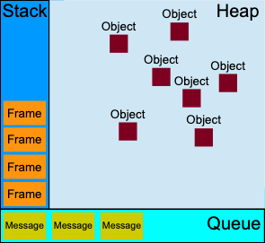

[toc]

---

参考: https://developer.mozilla.org/zh-CN/docs/Web/JavaScript

带有[]的表示有code demo

# LexicalGrammar 词汇语法
作用：解释 JavaScript 源文本
- 解释器流程
  1. 删除空格和注释
  2. 语法分析：标识符、关键字、文字和标点符号（主要是运算符）
  3. 自动插入分号

## 自动分号补全
一些 JavaScript 语句必须用分号结束，所以会被自动分号

## 注释
- hashbang 注释
指定JavaScript 解释器的路径
只允许一条
`#!` 开头, 之前不允许有任何类型的空格
```JavaScript
#!/usr/bin/env node

console.log("Hello world");
```
- 单行注释
```JavaScript
//
```
- 多行注释
```JavaScript
/* */
```


## 关键词，保留字
- 声明：
const var let
null  true  false
this  super
new
- 运算\表达式
typeof
delete
instanceof
void
- 控制流程：
if  else
switch  case  default
try catch finally throw
- 循环
for in
do while
break continue
- 函数和类
function  return
class
import
export

- 其他
with
extends
debugger
- 严格模式保留
let （也在 const 、 let 和类声明中保留）
static
yield （也在生成器函数体中保留）
implements
interface
package
private
protected
public

- 模块代码或异步函数体保留
await
- 其他
enum
arguments （不是关键字，但在严格模式下不能声明为标识符）

## 字面量/常量
- 空字面量
null

- 数值分隔符
可以使用下划线（_，U+005F）作为分隔符以增强数值字面量的可读性：
```JavaScript
1_000_000_000_000
1_050.95
0b1010_0001_1000_0101
0o2_2_5_6
0xA0_B0_C0
1_000_000_000_000_000_000_000n
```
- 数组字面量
```
[1954, 1974, 1990, 2014];
```

- 对象字面量
```JavaScript
var o = { a: "foo", b: "bar", c: 42 };

// ES6 中的简略表示方法
var a = "foo",
  b = "bar",
  c = 42;
var o = { a, b, c };
// 不需要这样
var o = { a: a, b: b, c: c };
```
- 模板字面量
```JavaScript
`string text`

`string text line 1
 string text line 2`

`string text ${expression} string text`

tag`string text ${expression} string text`

```


## [变量]
>var 变量
> 
>let 变量
> 
>const 常量

- [变量demo](./1Variables.js)
- var 与 let 的区别 (let 作用域限制严格)
  1. 作用域
    var 函数作用域, 整个函数内可用
    let 块作用域, 只在块内可用
  2. 变量提升
    var 变量提升, 可以在声明之前使用
    let 不会变量提升, 必须先声明再使用
  3. 重复声明
    var 可以重复声明, 后面的会覆盖前面的
    let 不可以重复声明, 会报错
  4. 全局对象属性, 全局作用域下的绑定
    var 声明的全局变量, 会成为全局对象的属性, 不会绑定当前块的作用域, 受外部影响
    let 声明的全局变量, 不会成为全局对象的属性, 会绑定当前块的作用域, 不受外部影响


- let 和 const (ES6)
const 关键字来定义一个常量，
let 关键字定义的限定范围内作用域的变量

## Scope 作用域

- Function scope 函数作用域 和 Global scope 全局作用域
var 在函数内声明变量, 是函数作用域
var 在函数外声明变量, 全局作用域

- Module scope 模块作用域 
- Block scope 块作用域 (ES6引入)
使用 let 或 const 声明变量


## 表达式和运算符

- []
数组初始化/字面量语法。
- {}
对象初始化/字面量语法。
- ( )
分组操作符

- ...
对象展开运算符
  1. 数组，展开运算符可以将数组中的每个元素解构出来，并将它们展开为一个新的数组
  ```js
  const array1 = [1, 2, 3];
  const array2 = [...array1, 4, 5, 6];
  console.log(array2); // 输出: [1, 2, 3, 4, 5, 6]
  ```
  2. 对象，展开运算符可以将对象的属性和值解构出来，并将它们展开为一个新的对象。如果在展开过程中出现相同的属性名，后面的属性会覆盖前面的属性
  ```js
  const obj1 = { a: 1, b: 2 };
  const obj2 = { ...obj1, c: 3, d: 4 };
  console.log(obj2); // 输出: { a: 1, b: 2, c: 3, d: 4 }
  ```

---

- delete
delete 运算符用来删除对象的属性。

- void
void 运算符表示表达式放弃返回值。

- typeof
typeof 运算符用来判断给定对象的类型。

- in
in 运算符用来判断对象是否拥有给定属性。

- instanceof
instanceof 运算符判断一个对象是否是另一个对象的实例。
---
- class 
关键字定义了类表达式。
- function 
关键字定义了函数表达式。

- this 
关键字指向函数的执行上下文
- super
super 关键字调用父类的构造器。

- async function
定义一个异步函数表达式。
- await
暂停或恢复执行异步函数，并等待 promise 的 resolve/reject 回调。

- async function*
async function* 定义了一个异步生成器函数表达式。
- function* 
关键字定义了一个 generator 函数表达式。
- yield 
暂停和恢复 generator 函数。
- yield* 
委派给另外一个 generator 函数或可迭代的对象。


# 数据类型和数据结构


## [动态和弱类型]
- [动态类型 demo](./0LexicalGrammar.js)
任何变量都可以被赋予（和重新赋予）各种类型的值

- [弱类型 demo](./0LexicalGrammar.js)
操作涉及不匹配的类型时，它 ==允许隐式类型转换==

## 类型
- Number（数字）
- String（字符串）
- Boolean（布尔）
- Symbol（符号）（ES2015 新增）
原子（atom）类型，创建一个唯一并且不可变的属性键
- Object（对象）
  - Function（函数）
  - Array（数组）
  - Date（日期）
  - RegExp（正则表达式）
- null（空）
表示**对象**的缺失
- undefined（未定义）
表示**值**的缺失
- Error（错误）类型


### 原始值
除了 Object 以外，类型都定义了表示在语言最低层面的**不可变值**
原始类型都有它们相应的对象包装类型，提供处理值的方法

类型|	typeof 返回值|	对象包装器|
-------- | -----|-----|
Null|	"object"|	/
Undefined|	"undefined"|	/
Boolean|	"boolean"|	Boolean
Number|	"number"|	Number
BigInt|	"bigint"|	BigInt
String|	"string"|	String
Symbol|	"symbol"|	Symbol

## [Object]
object 对象: 是拥有 属性 和 方法 的数据

JavaScript 中，对象是唯一**可变的值**

### 对象属性
- 属性=键值对
- 创建 会自动初始化一组有限的属性；这些属性还可以被添加和移除。
- 有两种对象属性的类型：数据属性和访问器属性
  1. 数据属性：key与value关联
  2. 访问器属性：key与get() set()关联

### 对象方法
[对象方法 demo](./2Object_Method.js)

### 标准内置对象 (standard built-in objects)
https://developer.mozilla.org/en-US/docs/Web/JavaScript/Reference/Global_Objects

#### value
globalThis
Infinity
NaN
undefined
#### Function
eval()
isFinite()
isNaN()
parseFloat()
parseInt()
decodeURI()
decodeURIComponent()
encodeURI()
encodeURIComponent()
#### Fundamental 基本对象
Object
Function
Boolean
Symbol
#### Error 错误对象
#### Numbers and dates  数字和日期
Number
BigInt
Math
Date
#### Text processing  文本处理
String
RegExp
#### Indexed collections  索引集合
Array
Int8Array
Uint8Array
Uint8ClampedArray
Int16Array
Uint16Array
Int32Array
Uint32Array
BigInt64Array
BigUint64Array
Float32Array
Float64Array
#### Keyed collections  键集合
Map
Set
WeakMap
WeakSet

#### Structured data  结构化数据
ArrayBuffer
SharedArrayBuffer
DataView
Atomics
JSON
#### Reflection  反射
Reflect
Proxy

### 全局对象（Global Object）
指的是全局范围内的对象。可以在全局作用域中使用 this 操作符访问
全局对象是全局变量的宿主
- `__filename`
当前正在执行的脚本的文件名
- `__dirname`
当前执行脚本所在的目录

- `setTimeout(cb, ms)` 全局函数
指定的毫秒(ms)数后执行指定函数(cb), 执行一次
- `clearTimeout(t)`
停止一个之前通过 setTimeout() 创建的定时器

- `setInterval(cb, ms)`
在指定的毫秒(ms)数后执行指定函数(cb), 一直执行
- `clearInterval(t) `
停止setInterval() 创建的定时器


# [function 函数]
[function demo](./3_0function.js)
函数是头等对象 (first-class)，**具有属性和方法**
与其他对象的区别在于函数**可以被调用**，是Function对象

提升（Hoisting）:作用域在声明之前

- 函数声明 (function statements)
```
function name([param[, param[, ... param]]]) { statements }
```
- 函数表达式 (function expression)
函数存储在变量
```
var myFunction = function name([param[, param[, ... param]]]) { statements }
```

- 箭头函数表达式 (=>)
箭头函数有两个方面的作用：更简短的函数并且不绑定this。

```
([param] [, param]) => { statements } 
param => { statements } 
() => { statements }
param => expression
```

- 构造函数 (new Function() )
很多时候需要避免使用 new 关键字
```
new Function (arg1, arg2, ... argN, functionBody)
```
## 生成器函数 generator function
返回一个 Generator 对象
符合可迭代协议和迭代器协议
- 函数生成器声明 (function* 语句)
```
function* name([param[, param[, ...param]]]) { statements }
```
- 函数生成器表达式 (function*表达式)
```
function* [name]([param] [, param] [..., param]) { statements }
```

## 闭包
在function执行完后, 让变量依然存在, 不被回收, 可被其他function使用

https://www.bilibili.com/video/BV1eh4y1i7yp/?spm_id_from=333.880.my_history.page.click&vd_source=60d40ab95cc774790f4ac09759b8a7b6

# [class 类]
[class demo](./4_0classes.js)
- 属性
- 方法
- [继承]()

# 异步


## [callback 回调]
>原始的异步函数实现方式

回调是一个简单的函数，它作为一个值传递给另一个函数，并且只在事件发生时执行
```js
//callback作为参数传递给doSomething
function doSomething(callback) {
  // 执行某些操作
  callback(); // 调用回调函数
}

// 1.将回调函数作为参数传递给doSomething函数
function callback() {
}
doSomething(callback); 

// 2.匿名函数
doSomething(function() {
});

// 3.箭头函数
doSomething(() => {
});
```

## [Promises]
>ES6, 现代 JavaScript 中异步编程的基础

Promises 表示异步操作最终完成或失败的对象
  有三种状态：pending（进行中）、fulfilled（已成功）、rejected（已失败）
```js
new Promise(function (resolve, reject) {
  // do...
});
```
- new Promise().then()
- new Promise().catch()
- Promise.all()
## [Async and Await] 同步,等待
>ES2017, 简化使用基于promise的API的异步语法

```js
//每次调用async函数时，它都会返回一个新的 Promise
async function name(param) {
  statements
  //可以使用 await 机制
  //挂起执行直到返回的promise被实现或拒绝, 强制异步操作以串联的方式完成
  await expression
}
```


# 运行时

- Stack 栈
先进后出, 从上到下执行 frame
调用一个函数, 会创建函数的 frame. 包含对函数的参数和局部变量的引用
子函数将创建第二个frame并将其推送到第一个frame的顶部
- Heap: 堆
建函数的frame时, 它的参数和局部变量会存储在Heap
- Queue: 队列
先进先出
每条消息都有一个关联的函数，Event Loop调用该函数,创建frame 来处理该消息。


## workers 多线程
单独线程 运行一些任务。
```ts
//创建 worker，这些代码就会运行
const worker = new Worker("./generate.js");
```
## Event Loop  事件循环
JavaScript 有一个基于事件循环的运行时模型，它负责执行代码、收集和处理事件以及执行排队的子任务。

- "Run-to-completion" “运行至完成”
函数运行时，它都不能被抢占

- Adding messages 添加消息
Web 浏览器 > 事件监听器 > 添加消息 > 执行函数

- Zero delays 零延误
因为“运行至完成”, 所以 `setTimeout(0)` 不一定立刻执行
需要等前面的Queue 执行完成

- Never blocking  永不阻塞
异步io, 期间不阻塞, 完成后触发io回调事件

- Several runtimes communicating together 多个运行时一起通信
Web Worker 或跨域 iframe 有自己的堆栈、堆和消息队列。两个不同的运行时只能通过 postMessage 方法发送消息来进行通信。如果另一个运行时侦听 message 事件，则此方法会向另一个运行时添加一条消息。
