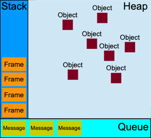

[toc]

## install
下载 https://dev.nodejs.cn/download/package-manager/

会安装 node.js 与 npm

```
node -v
```
### nvm 切换版本
轻松切换 Node.js 版本，并安装新版本以尝试在出现问题时轻松回滚
https://github.com/nvm-sh/nvm

## NPM 包管理
随同NodeJS一起安装的包管理工具
```
npm -v
```

升级npm
```
npm install npm -g
```

### npm安装模块

```shell
//清空NPM本地缓存
npm cache clear
//搜索
npm search <Module Name>

//安装单个包
npm install <Module Name>
npm install <Module Name>@<version>
npm i

npm clean-install #忽略devDependencies,不自动更新
npm ci

//查看
npm ls
//卸载
npm uninstall <Module Name>
//发布
npm publish
```
- 全局安装、本地安装
```
npm install express      # 本地安装 安装包放在 ./node_modules 下
npm install express -g   # 全局安装 安装包放在 /usr/local 下或者node的安装目录
```
- npx 临时安装
### package.json
位于模块的目录下，用于定义包的属性
```json
{
  "name": "包名",
  "description": "包的描述",
  "version": "4.13.3",
  "author": {包的作者姓名},
  "contributors": [{},{}],
  "repository": {
    "type": "包代码地址类型：git svn",
    "url": "git+https://github.com/strongloop/express.git"
  },
  "keywords": [关键字],
  "dependencies": {运行依赖包列表},
  "devDependencies": {开发依赖包列表}
}
```
#### npm install
`package.json`目录下运行npm安装会通过`package.json`的配置安装依赖

```
npm i
npm ci
npm install
```

#### npm run
运行`package.json` scripts 命令行任务
```
npm run <task-name>
```
- package.json
```
{
  "scripts": {
    <task-name> : <command>
    "start-dev": "node lib/server-development",
    "start": "node lib/server-production"
    "watch": "webpack --watch --progress --colors --config webpack.conf.js",
    "dev": "webpack --progress --colors --config webpack.conf.js",
    "prod": "NODE_ENV=production webpack -p --config webpack.conf.js"
  }
}
```

## NPX


## node cli 命令行
- 启动应用
```
node app.js
```

```
node --eval "script"
node -e "console.log(123)"
```
## Asynchronous 异步

- Timers  定时器
  setTimeout 和 setInterval 安排未来的函数
### Blocking vs Non-Blocking
Node.js标准库中的所有I/O方法都提供异步版本，这些方法是非阻塞的，并接受回调函数。
一些方法也有阻塞的对应方法，它们的名称以 Sync 结尾。
- Blocking 方法
```js
const fs = require('fs');

const data = fs.readFileSync('/file.md'); // blocks here until file is read
console.log(data);
moreWork(); // will run after console.log
```
- Non-Blocking 方法
```js
const fs = require('fs');

fs.readFile('/file.md', (err, data) => {
  if (err) throw err;
  console.log(data);
});
moreWork(); // will run before console.log
```
#### 顺序执行多个Non-Blocking
```js
const fs = require('fs');
//readFile先执行
fs.readFile('/file.md', (readFileErr, data) => {
  if (readFileErr) throw readFileErr;
  console.log(data);
  //unlink后执行
  fs.unlink('/file.md', unlinkErr => {
    if (unlinkErr) throw unlinkErr;
  });
});
```
### Callbacks 回调

你如何处理回调的错误？一个非常常见的策略是使用Node.js所采用的：任何回调函数中的第一个参数都是error对象：错误优先回调
```js
const fs = require('fs');

fs.readFile('/file.json', (err, data) => {
  if (err) {
    // handle error
    console.log(err);
    return;
  }

  // no errors, process data
  console.log(data);
});
```
### 立刻执行异步 setImmediate()
```js
setImmediate(() => {
  // run something
});
```


## 常用module
### nodemon 自动重新启动应用
- 安装nodemon
```
npm i -g nodemon
```
- 项目中依赖nodemon
```
nodemon app.js
```
- nodemon 启动应用
```
nodemon app.js
```
### process
process 核心模块: 不需要“require”，自动可用。


#### env 属性
process提供了 env 属性，它托管了进程启动时设置的所有环境变量。

1. node命令 带环境变量启动
```bash
[key=value ...] node app.js
```
```js
process.env.key; // "value"
```

2. .env 文件
```bash
# .env file
USER_ID="239482"
USER_KEY="foobar"
NODE_ENV="development"
```
dotenv包在运行时加载.env 文件
```js
require('dotenv').config();

process.env.USER_ID; // "239482"
process.env.USER_KEY; // "foobar"
process.env.NODE_ENV; // "development"
```

##### NODE_ENV 环境变量
```
NODE_ENV=production
```
- production
  日志记录保持在最低的基本级别
  会发生更多缓存级别以优化性能


- 配置方式
```bash
#shell配置文件
export NODE_ENV=production

#应用程序初始化命令
NODE_ENV=production node app.js
```
- 代码中使用方式
```
if (process.env.NODE_ENV === 'development') {
  // ...
}

if (process.env.NODE_ENV === 'production') {
  // ...
}

if (['production', 'staging'].includes(process.env.NODE_ENV)) {
  // ...
}
```
#### nextTick() 方法
-  tick
   每次事件循环进行一次完整的行程，我们称之为tick。

### events
事件处理, 观察者模式实现

#### EventEmitter 类
- 初始化
```js
// 引入 events 模块
const EventEmitter = require('events');
// 创建 eventEmitter 对象
const eventEmitter = new EventEmitter();
```
- on(event, listener)
  添加事件触发时执行的回调函数
```js
eventEmitter.on(event, (event_args) => {
  console.log('started');
});
```

- emit(event, [arg1], [arg2], [...])
  触发事件
```js
eventEmitter.emit(event, event_args);
```
- once(event, listener)
  添加一次性监听器, 触发后立刻解除该监听器
- removeListener(event, listener) / off()
  从事件中删除事件监听器
- removeAllListeners([event])
  删除事件的所有监听器

### readline 读取输入
### console 输出


### url 和 querystring 模块

## REPL 交互式解释器
可以用来快速探索Node.js特性
```
node
```


# 运行时
## 任务

在nodejs中，任务分为同步任务和异步任务，这两者的执行环境不同
- 同步任务会进入主线程, 按顺序执行, 不依赖于其他资源
- 异步任务会进入事件队列(EventQueue), 依赖于其他资源(网络,文件)


- Stack 栈
  先进后出, 从上到下执行 frame
  调用一个函数, 会创建函数的 frame. 包含对函数的参数和局部变量的引用
  子函数将创建第二个frame并将其推送到第一个frame的顶部
- Heap: 堆
  建函数的frame时, 它的参数和局部变量会存储在Heap
- Queue: 队列
  先进先出
  每条消息都有一个关联的函数，Event Loop调用该函数,创建frame 来处理该消息。


## Event Loop  事件循环
JavaScript 有一个基于事件循环的运行时模型，它负责执行代码、收集和处理事件以及执行排队的子任务。

当主线程代码执行完毕后，会去事件队列中读取对应的异步任务，并推到主线程中执行，不断重复过程，称为事件循环机制(EventLoop) 。

- "Run-to-completion" “运行至完成”
  函数运行时，它都不能被抢占

- Adding messages 添加消息
  Web 浏览器 > 事件监听器 > 添加消息 > 执行函数

- Zero delays 零延误
  因为“运行至完成”, 所以 `setTimeout(0)` 不一定立刻执行
  需要等前面的Queue 执行完成

- Never blocking  永不阻塞
  异步io, 期间不阻塞, 完成后触发io回调事件

- Several runtimes communicating together 多个运行时一起通信
  Web Worker 或跨域 iframe 有自己的堆栈、堆和消息队列。两个不同的运行时只能通过 postMessage 方法发送消息来进行通信。如果另一个运行时侦听 message 事件，则此方法会向另一个运行时添加一条消息。

# workers 多线程
单独线程 运行一些任务。
```ts
//创建 worker，这些代码就会运行
const worker = new Worker("./generate.js");
```
